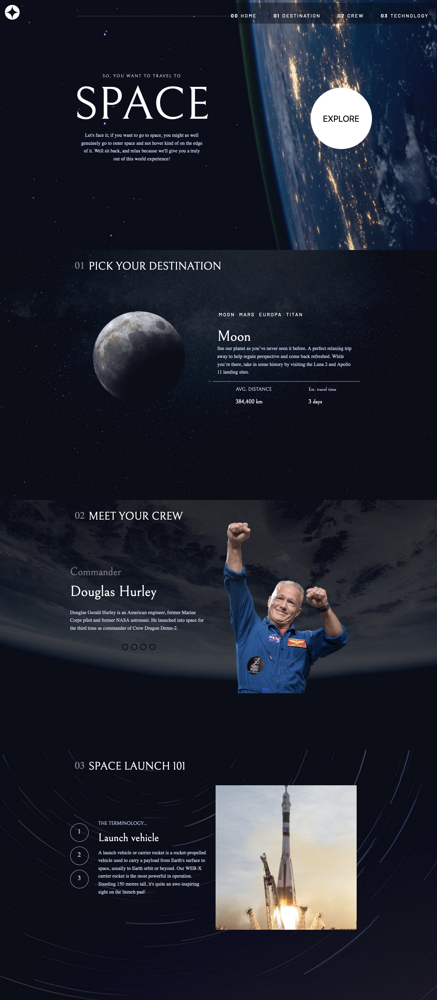
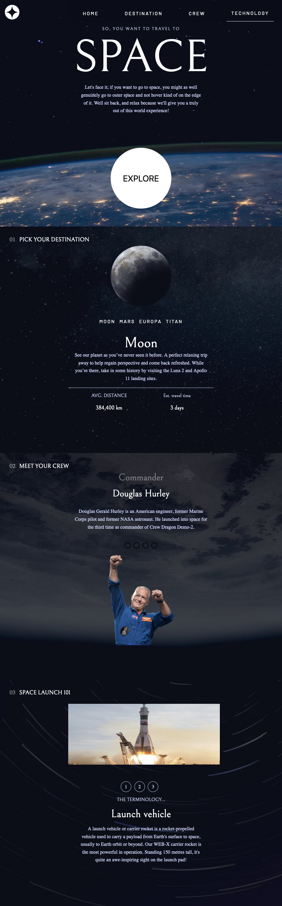
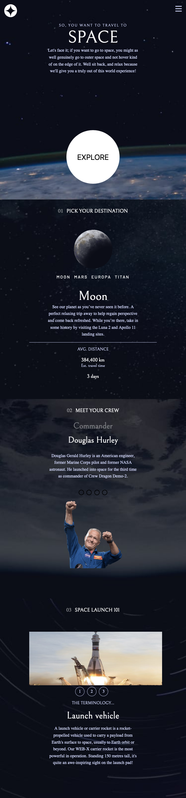

# Frontend Mentor - Space tourism website solution

This is a solution to the [Space tourism website challenge on Frontend Mentor](https://www.frontendmentor.io/challenges/space-tourism-multipage-website-gRWj1URZ3). Frontend Mentor challenges help you improve your coding skills by building realistic projects.

## Table of contents

- [Overview](#overview)

  - [Screenshot](#screenshot)
  - [Links](#links)

- [My process](#my-process)

  - [Built with](#built-with)

  - [Continued development](#continued-development)

- [Author](#author)
- [Acknowledgments](#acknowledgments)

**Note: Delete this note and update the table of contents based on what sections you keep.**

## Overview

This Project is Space tourism multi-page website, is my first challenge on Frontmentor website

### The challenge

Users should be able to:

- View the optimal layout for each of the website's pages depending on their device's screen size
- See hover states for all interactive elements on the page
- View each page and be able to toggle between the tabs to see new information

### Screenshot

**Note: Delete this note and the paragraphs above when you add your screenshot. If you prefer not to add a screenshot, feel free to remove this entire section.**

### Links

- Solution URL: (https://github.com/naglorias/space-travel-tourism-mutli-pages.git)
- Live Site URL: (https://spacing.vercel.app/)

## My process

### Built with

- Semantic HTML5 markup
- CSS custom properties
- CSS Flexbox
- Jquery
- Vanilla Javascript

**Note: These are just examples. Delete this note and replace the list above with your own choices**

### Continued development

I am looking for using more jquery and learning more about how to use fetch method and shift between properties and it values in JSON files , so that I can use a property in certain situation and replace it with another property in another one
**Note: Delete this note and the content within this section and replace with your own plans for continued development.**

## Author

- Website - [Naglaa Raslan](https://github.com/naglorias)
- Frontend Mentor - [@naglorias](hhttps://www.frontendmentor.io/profile/naglorias)

**Note: Delete this note and add/remove/edit lines above based on what links you'd like to share.**
